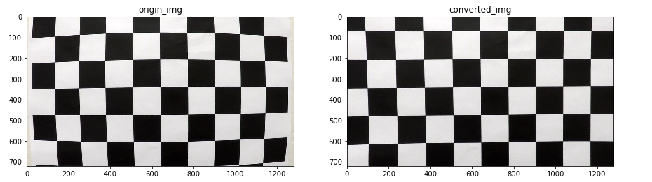
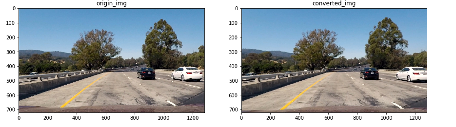
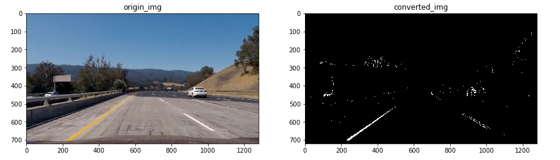
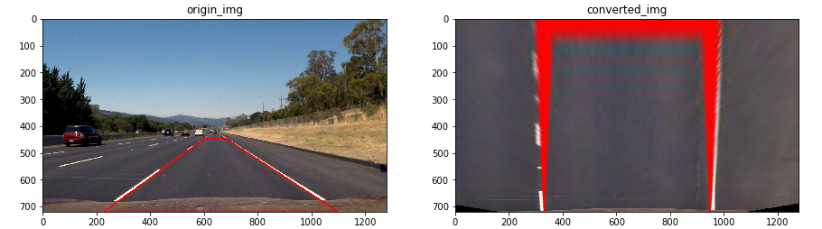
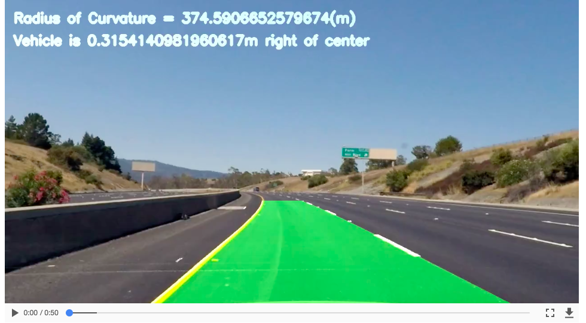

# 车道线检测

- 简介

  - 图像去畸变
  - 转换颜色空间和sobel变换，二值化，提取图像特征
  - 透视变换，把图像转换为鸟瞰图
  - 计算左右车道线曲线参数
  - 填充左右车道线中间的多边形
  - 计算曲率和中心偏移距离
  - 把计算后的图像和原图像合并

- 图像去畸变

  > 根据从各个角度拍摄的图像计算相机的校准参数

  ```python
  # 定义棋盘横向和纵向的角点个数
  nx = 9
  ny = 6
  def cal_calibrate_params(file_paths):
      
      object_points = []
      image_points = []
      # 对象点的坐标
      objp = np.zeros((nx*ny , 3), np.float32)
      objp[:,:2] = np.mgrid[0:nx, 0:ny].T.reshape(-1, 2)
      # 检测每幅图像角点坐标
      for file_path in file_paths:
          img = mpimg.imread(file_path)
          gray = cv2.cvtColor(img, cv2.COLOR_BGR2GRAY)
          rect, corners = cv2.findChessboardCorners(gray, (nx, ny), None)
          if rect == True:
              object_points.append(objp)
              image_points.append(corners)
      # 获取畸变系数
      ret, mtx, dist, rvecs, tvecs = cv2.calibrateCamera(object_points, image_points, gray.shape[::-1], None, None)
      return ret, mtx, dist, rvecs, tvecs
  ```

  > 根据上边求得的相机校准参数给图像去畸变

  ```python
  def img_undistort(img, mtx, dist):
      return cv2.undistort(img, mtx, dist, None, mtx)

  # 测试去畸变函数的效果
  file_paths = glob.glob("./camera_cal/calibration*.jpg")
  ret, mtx, dist, rvecs, tvecs = cal_calibrate_params(file_paths)
  if mtx != None:
      img = mpimg.imread("./camera_cal/calibration1.jpg")
      undistort_img = img_undistort(img, mtx, dist)
      plot_contrast_imgs(img, undistort_img)
      print("done!")
  else:
      print("failed")
  ```

  > 结果

  

  > 展示车道线检测的图像去畸变

  

- 转换颜色空间和sobel变换，二值化，提取图像特征

  > 组合各种特征得到结果，可以结合每种图像特征提取方法的优势。
  >
  > 比如，提高亮度，可以去掉阴影。

  ```python
  def pipeline(img, s_thresh=(170, 255), sx_thresh=(40, 200)):
      """
      使用sobel和选择颜色空间对图像进行处理
      """
      
      img = np.copy(img)
      
      # 转换为HSL颜色空间
      hls = cv2.cvtColor(img, cv2.COLOR_RGB2HLS).astype(np.float)
      h_channel = hls[:,:,0]
      l_channel = hls[:,:,1]
      s_channel = hls[:,:,2]
      # Sobel x
      sobelx = cv2.Sobel(l_channel, cv2.CV_64F, 1, 0) # Take the derivative in x
      abs_sobelx = np.absolute(sobelx) 
      scaled_sobel = np.uint8(255*abs_sobelx/np.max(abs_sobelx))
      
      # Threshold x gradient
      sxbinary = np.zeros_like(scaled_sobel)
      sxbinary[(scaled_sobel >= sx_thresh[0]) & (scaled_sobel <= sx_thresh[1])] = 1
      
      # Threshold color channel
      s_binary = np.zeros_like(s_channel)
      s_binary[(s_channel >= s_thresh[0]) & (s_channel <= s_thresh[1]) ] = 1
      color_binary = np.zeros_like(sxbinary)
      color_binary[((sxbinary ==1) | (s_binary==1)) & (l_channel>100)] = 1
      return color_binary

  # 测试使用sobel和选择颜色空间
  img = mpimg.imread("./test/frame45.jpg")
  result = pipeline(img)
  plot_contrast_imgs(img, result, converted_img_gray=True)
  ```

  

- 透视变换，转换为鸟瞰图

  > 每一个角度拍摄的透视变换矩阵都不一样，无人车摄像头的角度不会变，所以只计算一次就可以了。
  >
  > 不仅需要计算怎么转换到鸟瞰图，而且需要从鸟瞰图转换回来，所以需要两个转换矩阵。
  >
  > 但是转换后的结果感觉不大好，有阴影。这个地方可能有点问题。

  ```python
  def cal_perspective_params(img, points):
      """
      计算透视变换参数
      """
      
      offset_x = 330
      offset_y = 0
      img_size = (img.shape[1], img.shape[0])
      src = np.float32(points)
      dst = np.float32([[offset_x, offset_y], [img_size[0]-offset_x, offset_y],
                        [offset_x, img_size[1]-offset_y],
                        [img_size[0]-offset_x, img_size[1]-offset_y]
                  ])
      M = cv2.getPerspectiveTransform(src, dst)
      M_inverse = cv2.getPerspectiveTransform(dst, src)
      return M, M_inverse
     
  def img_perspect_transform(img, M):
      '''
      图像透视变换
      '''
      
      img_size = (img.shape[1], img.shape[0])
      return cv2.warpPerspective(img, M, img_size)

  # 获取透视变换参数
  img = mpimg.imread("./test_images/straight_lines2.jpg")
  img = cv2.line(img, (601, 448), (683, 448), (255,0,0),1)
  img = cv2.line(img, (683, 448), (1097, 717), (255,0,0),1)
  img = cv2.line(img, (1097, 717), (230, 717), (255,0,0),1)
  img = cv2.line(img, (230, 717), (601, 448), (255,0,0),1)
  img = cv2.cvtColor(img, cv2.COLOR_RGB2BGR)
  cv2.imwrite("./test_images/straight_lines2_line.jpg", img)
  undistort_img = img_undistort(img, mtx, dist)
  points = [[601, 448], [683, 448], [230, 717], [1097, 717]]
  M, M_inverse = cal_perspective_params(img, points)

  # 测试透视图变换
  if M != None:
      origin_img = mpimg.imread("./test_images/test6.jpg")
      undistort_img = img_undistort(origin_img, mtx, dist)
      rigin_pipline_img = pipeline(undistort_img)
      transform_img = img_perspect_transform(rigin_pipline_img, M)
      plot_contrast_imgs(origin_img, transform_img, converted_img_gray=True)
  else:
      print("transform failed!")
  ```

  

- 计算左右车道线曲线参数

  1. 图像一分为二，获取图像像素值直方图，得到左右最大值点，作为开始点。
  2. 滑动窗口，把图像分成几个窗口
  3. x轴设置像素值统计范围，分别统计每个窗口内不为0的像素点，求平均值
  4. 对所有窗口求得的平均点进行曲线拟合，获取参数

  ```python
  def cal_line_param(binary_warped):
      """
      binary_warped：图像处理过后的二值图像
      """
      
      # 图像的下半部分直方图统计
      histogram = np.sum(binary_warped[int(binary_warped.shape[0]/2):,:], axis=0)
      # 在统计结果中找到左右最大的点的位置，作为左右车道检测的开始点
      midpoint = np.int(histogram.shape[0]/2)
      leftx_base = np.argmax(histogram[:midpoint])
      rightx_base = np.argmax(histogram[midpoint:]) + midpoint
      # 设置滑动窗口的数量，计算每一个窗口的高度
      nwindows = 9
      window_height = np.int(binary_warped.shape[0]/nwindows)
      # 获取图像中不为0的点
      nonzero = binary_warped.nonzero()
      nonzeroy = np.array(nonzero[0])
      nonzerox = np.array(nonzero[1])
      # 车道检测的当前位置
      leftx_current = leftx_base
      rightx_current = rightx_base
      # 设置x的检测范围
      margin = 100
      # 设置最小像素点
      minpix = 50
      # 记录检测出的左右车道点
      left_lane_inds = []
      right_lane_inds = []

      # 遍历该副图像中的每一个窗口
      for window in range(nwindows):
          # 设置窗口的x,y的检测范围
          win_y_low = binary_warped.shape[0] - (window+1)*window_height
          win_y_high = binary_warped.shape[0] - window*window_height
          win_xleft_low = leftx_current - margin
          win_xleft_high = leftx_current + margin
          win_xright_low = rightx_current - margin
          win_xright_high = rightx_current + margin
          
          
          # 获得在窗口内部，且不为0的点
          good_left_inds = ((nonzeroy >= win_y_low) & (nonzeroy < win_y_high) & 
          (nonzerox >= win_xleft_low) &  (nonzerox < win_xleft_high)).nonzero()[0]
          good_right_inds = ((nonzeroy >= win_y_low) & (nonzeroy < win_y_high) & 
          (nonzerox >= win_xright_low) &  (nonzerox < win_xright_high)).nonzero()[0]
          left_lane_inds.append(good_left_inds)
          right_lane_inds.append(good_right_inds)
          
          # 如果获取的点的个数大于最小个数，把该点集合的平均值设置当前点
          if len(good_left_inds) > minpix:
              leftx_current = np.int(np.mean(nonzerox[good_left_inds]))
          if len(good_right_inds) > minpix:        
              rightx_current = np.int(np.mean(nonzerox[good_right_inds]))
      
      # 把检测出所有左右车道点分别进行合并
      left_lane_inds = np.concatenate(left_lane_inds)
      right_lane_inds = np.concatenate(right_lane_inds)
      
      # 在图像中获取这些点
      leftx = nonzerox[left_lane_inds]
      lefty = nonzeroy[left_lane_inds] 
      rightx = nonzerox[right_lane_inds]
      righty = nonzeroy[right_lane_inds] 
      
      # 用曲线拟合检测出的点
      left_fit = np.polyfit(lefty, leftx, 2)
      right_fit = np.polyfit(righty, rightx, 2)
      return left_fit,right_fit
  ```

- 计算图像的中心点

  > 假设straight_lines2_line.jpg，这张图片是位于车道的中央，实际情况可以根据测量验证。

  ```python
  def cal_line__center(img):
      undistort_img = img_undistort(img, mtx, dist)
      rigin_pipline_img = pipeline(undistort_img)
      transform_img = img_perspect_transform(rigin_pipline_img, M)
      left_fit,right_fit = cal_line_param(transform_img)
      y_max = img.shape[0] 
      left_x = left_fit[0]*y_max**2 + left_fit[1]*y_max + left_fit[2]
      right_x = right_fit[0]*y_max**2 + right_fit[1]*y_max + right_fit[2]
      return (left_x+right_x)/2

  img = mpimg.imread("./test_images/straight_lines2_line.jpg")
  lane_center = cal_line__center(img)
  print("车道的中心点为：{}".format(lane_center))
  ```

- 根据拟合的曲线，画出两条车道线之间的多边形

  ```python
  def fill_lane_poly(img, left_fit, right_fit):
      y_max = img.shape[0]
      out_img = np.dstack((img, img, img))*255
      left_ponits = [[left_fit[0]*y**2 + left_fit[1]*y + left_fit[2], y] for y in range(y_max)]
      right_ponits = [[right_fit[0]*y**2 + right_fit[1]*y + right_fit[2], y] for y in range(y_max-1, -1, -1)]
      line_points = np.vstack((left_ponits,right_ponits))
      cv2.fillPoly(out_img, np.int_([line_points]), (0,255, 0))
      return out_img
  ```

- 把曲线转换到真实环境中，计算曲线的曲率

  ```python
  def cal_radius(img, left_fit, right_fit):
      """
      把曲线转换到真实环境中，计算曲线的曲率和相对中间位置的偏移
      """

      # 像素点和真实场景中的比率
      ym_per_pix = 30/720
      xm_per_pix = 3.7/700

      # 计算得到曲线上的每个点
      left_y_axis = np.linspace(0, img.shape[0], img.shape[0]-1)
      left_x_axis = left_fit[0]*left_y_axis**2 + left_fit[1]*left_y_axis + left_fit[2]
      right_y_axis = np.linspace(0, img.shape[0], img.shape[0]-1)
      right_x_axis = right_fit[0]*right_y_axis**2 + right_fit[1]*right_y_axis + right_fit[2]

      # 获取真实环境中的曲线
      left_fit_cr = np.polyfit(left_y_axis*ym_per_pix, left_x_axis*xm_per_pix, 2)
      right_fit_cr = np.polyfit(right_y_axis*ym_per_pix, right_x_axis*xm_per_pix, 2)
      
      # 获得真实环境中的曲线曲率
      left_curverad = ((1 + (2*left_fit_cr[0]*left_y_axis*ym_per_pix + left_fit_cr[1])**2)**1.5) / np.absolute(2*left_fit_cr[0])
      right_curverad = ((1 + (2*right_fit_cr[0]*right_y_axis*ym_per_pix + right_fit_cr[1])**2)**1.5) / np.absolute(2*right_fit_cr[0])
      
      # 在图像上显示曲率
      cv2.putText(img,'Radius of Curvature = {}(m)'.format(np.mean(left_curverad)), (20,50),cv2.FONT_ITALIC, 1 , (255,255,255), 5)
      return img
  ```

- 计算中心点偏移

  ```python
  def cal_center_departure(img, left_fit, right_fit):
     
      # 计算中心点
      y_max = img.shape[0] 
      left_x = left_fit[0]*y_max**2 + left_fit[1]*y_max + left_fit[2]
      right_x = right_fit[0]*y_max**2 + right_fit[1]*y_max + right_fit[2]
      xm_per_pix = 3.7 / 700
      center_depart = ((left_x+right_x) / 2 - lane_center)*xm_per_pix
      
      # 在图像上显示偏移
      if center_depart > 0:
          cv2.putText(img,'Vehicle is {}m right of center'.format(center_depart), (20,100),cv2.FONT_ITALIC, 1 , (255,255,255), 5)
      elif center_depart < 0:
          cv2.putText(img,'Vehicle is {}m left of center'.format(-center_depart), (20,100),cv2.FONT_ITALIC, 1 , (255,255,255), 5)
      else:
          cv2.putText(img,'Vehicle is in the center', (20,100),cv2.FONT_ITALIC, 1 , (255,255,255), 5)
      return img
  ```

- 汇总如上的所有方法，对图像进行处理

  ```python
  def process_image(img):
      """
      图像处理，将上面的所有方法进行汇总
      """
      
      undistort_img = img_undistort(img, mtx, dist)
      rigin_pipline_img = pipeline(undistort_img)
      transform_img = img_perspect_transform(rigin_pipline_img, M)
      left_fit, right_fit = cal_line_param(transform_img)
      result = fill_lane_poly(transform_img, left_fit, right_fit)
      transform_img_inverse = img_perspect_transform(result, M_inverse)
      transform_img_inverse = cal_radius(transform_img_inverse, left_fit, right_fit)
      transform_img_inverse = cal_center_departure(transform_img_inverse, left_fit, right_fit)
      transform_img_inverse = cv2.addWeighted(undistort_img, 1, transform_img_inverse, 0.5, 0)
      return transform_img_inverse
  ```

- 使用上边的图像处理方法，对视频中的车道线进行检测。

  ```python
  from moviepy.editor import VideoFileClip

  clip1 = VideoFileClip("project_video.mp4")
  white_clip = clip1.fl_image(process_image)
  #white_clip.write_images_sequence("test_challenge/frame%2d.jpg")
  white_clip.write_videofile("project_video_output.mp4", audio=False)
  ```

  >展示结果，[视频地址](project_video_output.mp4)

  
